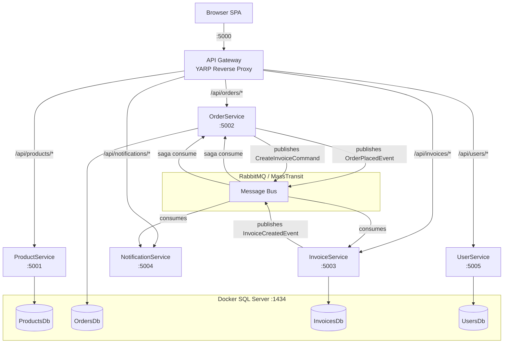
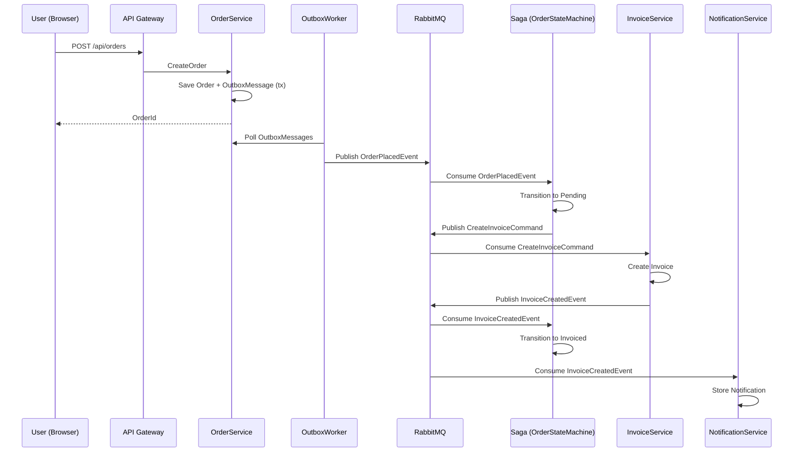

# E-Commerce Microservices

A .NET 9 microservices e-commerce system with event-driven orchestration using MassTransit, RabbitMQ, and SQL Server.

## Architecture



### Order Flow



## Services

| Service | Port | DB | Description |
|---------|------|----|-------------|
| **ApiGateway** | 5000 | — | YARP reverse proxy + static frontend |
| **ProductService** | 5001 | ProductsDb | Product CRUD + stock decrement |
| **OrderService** | 5002 | OrdersDb | Order creation, outbox, saga orchestration |
| **InvoiceService** | 5003 | InvoicesDb | Invoice creation via message consumer |
| **NotificationService** | 5004 | In-memory | Receives InvoiceCreatedEvent, stores notifications |
| **UserService** | 5005 | UsersDb | Customer CRUD (Name, Type, Address, Email, Tel, City, Currency EGP) |

## Prerequisites

- [Docker Desktop](https://www.docker.com/products/docker-desktop/)
- [.NET 9 SDK](https://dotnet.microsoft.com/en-us/download/dotnet/9.0)

## Infrastructure Setup

```bash
docker compose up -d
```

This starts:
- **RabbitMQ** (ports 5672, 15672) — message broker
- **Redis** (port 6379) — cache (reserved)

## Build & Run

```bash
# Build everything
dotnet build src\ApiGateway\ApiGateway
dotnet build src\ProductService\ProductService.Api
dotnet build src\OrderService\OrderService.Api
dotnet build src\InvoiceService\InvoiceService.Api
dotnet build src\NotificationService\NotificationService.Worker
dotnet build src\UserService\UserService.Api

# Start services (each in its own terminal)
dotnet run --project src\ProductService\ProductService.Api --urls http://localhost:5001
dotnet run --project src\OrderService\OrderService.Api --urls http://localhost:5002
dotnet run --project src\InvoiceService\InvoiceService.Api --urls http://localhost:5003
dotnet run --project src\NotificationService\NotificationService.Worker --urls http://localhost:5004
dotnet run --project src\UserService\UserService.Api --urls http://localhost:5005
dotnet run --project src\ApiGateway\ApiGateway --urls http://localhost:5000
```

Or open the solution in Visual Studio 2026+ and run all projects with multiple startup projects.

## Project Structure

```
ECommerce.slnx
└── src/
    ├── ApiGateway/
    │   └── ApiGateway/
    │       ├── wwwroot/index.html          # SPA Dashboard
    │       ├── Program.cs                  # YARP reverse proxy config
    │       └── appsettings.json            # Route definitions
    │
    ├── ProductService/
    │   └── ProductService.Api/
    │       ├── Entities/Product.cs
    │       ├── Data/ProductDbContext.cs
    │       ├── Controllers/ProductsController.cs
    │       └── Program.cs
    │
    ├── OrderService/
    │   └── OrderService.Api/
    │       ├── Entities/{Order,OutboxMessage}.cs
    │       ├── Sagas/{OrderState,OrderStateMachine}.cs
    │       ├── Workers/OutboxWorker.cs
    │       ├── Data/OrderDbContext.cs
    │       ├── Controllers/OrdersController.cs
    │       └── Program.cs
    │
    ├── InvoiceService/
    │   └── InvoiceService.Api/
    │       ├── Entities/{Invoice,ProcessedEvent}.cs
    │       ├── Consumers/InvoiceConsumer.cs
    │       ├── Data/InvoiceDbContext.cs
    │       ├── Controllers/InvoicesController.cs
    │       └── Program.cs
    │
    ├── NotificationService/
    │   └── NotificationService.Worker/
    │       ├── Consumers/NotificationConsumer.cs
    │       ├── Data/NotificationStore.cs
    │       └── Program.cs
    │
    ├── UserService/
    │   └── UserService.Api/
    │       ├── Entities/User.cs
    │       ├── Data/UserDbContext.cs
    │       ├── Controllers/UsersController.cs
    │       └── Program.cs
    │
    └── Shared/
        └── Shared.Contracts/
            ├── Commands/{CreateInvoiceCommand,NotifyUserCommand,ReleaseInventoryCommand}.cs
            └── Events/{OrderPlacedEvent,InvoiceCreatedEvent,InvoiceFailedEvent}.cs
```

## API Endpoints

### Products (`/api/products`)
| Method | Path | Description |
|--------|------|-------------|
| GET | `/api/products` | List all |
| GET | `/api/products/{id}` | Get by ID |
| POST | `/api/products` | Create |
| POST | `/api/products/{id}/decrement` | Decrement stock |

### Orders (`/api/orders`)
| Method | Path | Description |
|--------|------|-------------|
| GET | `/api/orders` | List all (includes saga status) |
| POST | `/api/orders` | Create order (triggers saga) |
| POST | `/api/orders/{id}/retry` | Reset saga + requeue event |

### Invoices (`/api/invoices`)
| Method | Path | Description |
|--------|------|-------------|
| GET | `/api/invoices` | List all (optional `?orderId=` filter) |
| GET | `/api/invoices/{id}` | Get by ID |

### Notifications (`/api/notifications`)
| Method | Path | Description |
|--------|------|-------------|
| GET | `/api/notifications` | List all |

### Users (`/api/users`)
| Method | Path | Description |
|--------|------|-------------|
| GET | `/api/users` | List all |
| GET | `/api/users/{id}` | Get by ID |
| POST | `/api/users` | Create |
| PUT | `/api/users/{id}` | Update |
| DELETE | `/api/users/{id}` | Delete |

## Dashboard

Open `http://localhost:5000` for the SPA dashboard with tabs:
- **Products** — Add, list, decrement stock
- **Orders** — Place order (select product + user), filter by product/user/date/search, retry stuck orders
- **Invoices** — List with preview modal (print/PDF)
- **Notifications** — View notification log
- **Users** — CRUD with currency defaulting to EGP

## Tech Stack

- **.NET 9** — Web API, Minimal API
- **MassTransit 8.3** — Message bus abstraction
- **RabbitMQ** — Message broker
- **Entity Framework Core 9** — ORM with SQL Server
- **SQL Server 2019** (Docker) — Database per service
- **YARP 2** — Reverse proxy / API Gateway
- **Bootstrap 5** — Frontend UI
- **Outbox Pattern** — Reliable message publishing via `OutboxWorker`
- **Saga Pattern** — Order orchestration via `OrderStateMachine`
